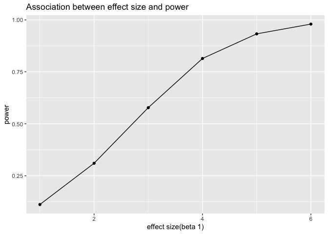
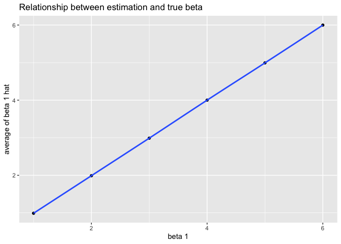
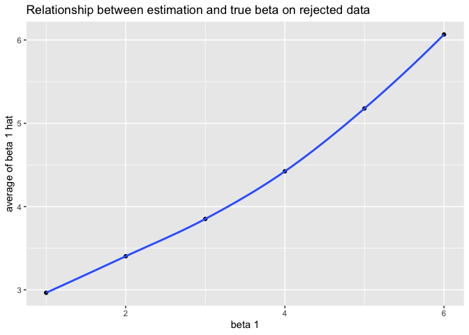

hw 5
================
Wurongyan Zhang
11/5/2019

## problem 1

``` r
library(tidyverse)
```

    ## ─ Attaching packages ───────────────────── tidyverse 1.2.1 ─

    ## ✔ ggplot2 3.2.1     ✔ purrr   0.3.2
    ## ✔ tibble  2.1.3     ✔ dplyr   0.8.3
    ## ✔ tidyr   1.0.0     ✔ stringr 1.4.0
    ## ✔ readr   1.3.1     ✔ forcats 0.4.0

    ## ─ Conflicts ─────────────────────── tidyverse_conflicts() ─
    ## ✖ dplyr::filter() masks stats::filter()
    ## ✖ dplyr::lag()    masks stats::lag()

``` r
library(ggplot2)

set.seed(10)

iris_with_missing = iris %>% 
  map_df(~replace(.x, sample(1:150, 20), NA)) %>%
  mutate(Species = as.character(Species))
```

``` r
summary(is.na(iris_with_missing)) %>% 
  knitr::kable()
```

|  | Sepal.Length  | Sepal.Width   | Petal.Length  | Petal.Width   |    Species    |
|  | :------------ | :------------ | :------------ | :------------ | :-----------: |
|  | Mode :logical | Mode :logical | Mode :logical | Mode :logical | Mode :logical |
|  | FALSE:130     | FALSE:130     | FALSE:130     | FALSE:130     |   FALSE:130   |
|  | TRUE :20      | TRUE :20      | TRUE :20      | TRUE :20      |   TRUE :20    |

``` r
summary(iris_with_missing) %>% 
  knitr::kable()
```

|  | Sepal.Length  |  Sepal.Width  | Petal.Length  |  Petal.Width  |     Species      |
|  | :-----------: | :-----------: | :-----------: | :-----------: | :--------------: |
|  |  Min. :4.300  |  Min. :2.000  |  Min. :1.000  |  Min. :0.100  |    Length:150    |
|  | 1st Qu.:5.100 | 1st Qu.:2.800 | 1st Qu.:1.600 | 1st Qu.:0.300 | Class :character |
|  | Median :5.700 | Median :3.000 | Median :4.400 | Median :1.300 | Mode :character  |
|  |  Mean :5.819  |  Mean :3.075  |  Mean :3.765  |  Mean :1.192  |        NA        |
|  | 3rd Qu.:6.400 | 3rd Qu.:3.400 | 3rd Qu.:5.100 | 3rd Qu.:1.800 |        NA        |
|  |  Max. :7.900  |  Max. :4.400  |  Max. :6.900  |  Max. :2.500  |        NA        |
|  |   NA’s :20    |   NA’s :20    |   NA’s :20    |   NA’s :20    |        NA        |

As we can see from the summary above, the data set iris\_with\_missing
has 20 missing values in each of the 5 variables.

``` r
na_func = function(x){
  if(is.character(x)){
    x=replace_na(x,"virginica")
  }
  else if(is.numeric(x)){
    x=replace_na(x, round(mean(x,na.rm=TRUE),digits=1))
  }
  x
}

iris=map_dfr(iris_with_missing,na_func)

summary(is.na(iris))%>% 
  knitr::kable()
```

|  | Sepal.Length  | Sepal.Width   | Petal.Length  | Petal.Width   |    Species    |
|  | :------------ | :------------ | :------------ | :------------ | :-----------: |
|  | Mode :logical | Mode :logical | Mode :logical | Mode :logical | Mode :logical |
|  | FALSE:150     | FALSE:150     | FALSE:150     | FALSE:150     |   FALSE:150   |

As we can see from the second table, there are no missing values after
the function.

## problem 2

``` r
file = list.files("data")

file_data = purrr::map_dfr( str_c("./data/",file), read_csv) %>% 
 janitor::clean_names() %>% 
  mutate(file_name=file) %>% 
  mutate(file_name=str_remove(file_name,".csv")) %>% 
  separate(file_name, into = c("arm","subject_id"),sep="_") %>% arrange(arm,subject_id) %>% 
  select(subject_id, arm, everything())
  
 file_data %>% 
   knitr::kable()
```

| subject\_id | arm | week\_1 | week\_2 | week\_3 | week\_4 | week\_5 | week\_6 | week\_7 | week\_8 |
| :---------- | :-- | ------: | ------: | ------: | ------: | ------: | ------: | ------: | ------: |
| 01          | con |    0.20 |  \-1.31 |    0.66 |    1.96 |    0.23 |    1.09 |    0.05 |    1.94 |
| 02          | con |    1.13 |  \-0.88 |    1.07 |    0.17 |  \-0.83 |  \-0.31 |    1.58 |    0.44 |
| 03          | con |    1.77 |    3.11 |    2.22 |    3.26 |    3.31 |    0.89 |    1.88 |    1.01 |
| 04          | con |    1.04 |    3.66 |    1.22 |    2.33 |    1.47 |    2.70 |    1.87 |    1.66 |
| 05          | con |    0.47 |  \-0.58 |  \-0.09 |  \-1.37 |  \-0.32 |  \-2.17 |    0.45 |    0.48 |
| 06          | con |    2.37 |    2.50 |    1.59 |  \-0.16 |    2.08 |    3.07 |    0.78 |    2.35 |
| 07          | con |    0.03 |    1.21 |    1.13 |    0.64 |    0.49 |  \-0.12 |  \-0.07 |    0.46 |
| 08          | con |  \-0.08 |    1.42 |    0.09 |    0.36 |    1.18 |  \-1.16 |    0.33 |  \-0.44 |
| 09          | con |    0.08 |    1.24 |    1.44 |    0.41 |    0.95 |    2.75 |    0.30 |    0.03 |
| 10          | con |    2.14 |    1.15 |    2.52 |    3.44 |    4.26 |    0.97 |    2.73 |  \-0.53 |
| 01          | exp |    3.05 |    3.67 |    4.84 |    5.80 |    6.33 |    5.46 |    6.38 |    5.91 |
| 02          | exp |  \-0.84 |    2.63 |    1.64 |    2.58 |    1.24 |    2.32 |    3.11 |    3.78 |
| 03          | exp |    2.15 |    2.08 |    1.82 |    2.84 |    3.36 |    3.61 |    3.37 |    3.74 |
| 04          | exp |  \-0.62 |    2.54 |    3.78 |    2.73 |    4.49 |    5.82 |    6.00 |    6.49 |
| 05          | exp |    0.70 |    3.33 |    5.34 |    5.57 |    6.90 |    6.66 |    6.24 |    6.95 |
| 06          | exp |    3.73 |    4.08 |    5.40 |    6.41 |    4.87 |    6.09 |    7.66 |    5.83 |
| 07          | exp |    1.18 |    2.35 |    1.23 |    1.17 |    2.02 |    1.61 |    3.13 |    4.88 |
| 08          | exp |    1.37 |    1.43 |    1.84 |    3.60 |    3.80 |    4.72 |    4.68 |    5.70 |
| 09          | exp |  \-0.40 |    1.08 |    2.66 |    2.70 |    2.80 |    2.64 |    3.51 |    3.27 |
| 10          | exp |    1.09 |    2.80 |    2.80 |    4.30 |    2.25 |    6.57 |    6.09 |    4.64 |

``` r
file_data_week=file_data %>% 
  pivot_longer(week_1:week_8,
               names_to="weeks",
               values_to = "values") %>% 
  separate(weeks, into = c("week","weeks"),sep = "_")

file_data_week %>% 
  ggplot(aes(x=weeks, y=values, group=subject_id, color=subject_id))+
  geom_line()+facet_grid(~arm) +
  labs(title = "Observations on each subject over time")
```

<!-- -->

\#comments

## problem 3

``` r
set.seed(100)

sim_regression= function(beta1,n=30, beta0=2,sigma_squared=50){
  sim_data= tibble(
    x=rnorm(n,mean=0, sd=1),
    y=beta0+beta1*x+rnorm(n,mean=0,sd=sqrt(sigma_squared))
  )
  
  ls_fit= lm(y~x, data=sim_data) %>% 
    broom::tidy() %>% 
    select(term, estimate, p.value) %>% 
    mutate(term=recode(term, "x"="beta1_hat")) %>% 
    filter(term=="beta1_hat") 
  
}
```

``` r
sim_results=
  rerun(10000, sim_regression(beta1=0)) %>%bind_rows()
```

``` r
sim_results16= 
  tibble(beta1=c(1:6)) %>% 
  mutate(model= map(beta1,~rerun(10000, sim_regression(beta1=.x)))) %>% 
  unnest() %>% 
  unnest
```

    ## Warning: `cols` is now required.
    ## Please use `cols = c(model)`
    
    ## Warning: `cols` is now required.
    ## Please use `cols = c(model)`

``` r
sim_results16 %>% 
  group_by(beta1) %>% 
  summarise(total=n(),
            alpha=sum(p.value<0.05)/total) %>% ggplot(aes(y=alpha, x=beta1)) +geom_point()+geom_line()+labs(title = "Association between effect size and power", x= "effect size(beta 1)", y= "power")
```

<!-- -->

The relationship between effect size and power is positive and at a
certain point the rate of increasing will decrease.

``` r
average = 
  sim_results16 %>% 
  pivot_wider(names_from = term,
              values_from = estimate) %>% 
  group_by(beta1) %>% 
  summarise(avg_beta=mean(beta1_hat))
```

``` r
null_reject =
  sim_results16 %>% 
  pivot_wider(names_from = term,
              values_from = estimate) %>% filter(p.value<0.05) %>% group_by(beta1) %>% summarise(avg_beta_null=mean(beta1_hat))
```

``` r
average %>% ggplot(aes(x=beta1, y=avg_beta))+ geom_point()+geom_smooth()+labs(title="Relationship between estimation and true beta", x="beta 1", y="average of beta 1 hat")
```

    ## `geom_smooth()` using method = 'loess' and formula 'y ~ x'

    ## Warning in simpleLoess(y, x, w, span, degree = degree, parametric =
    ## parametric, : Chernobyl! trL>n 6
    
    ## Warning in simpleLoess(y, x, w, span, degree = degree, parametric =
    ## parametric, : Chernobyl! trL>n 6

    ## Warning in sqrt(sum.squares/one.delta): 产生了NaNs

    ## Warning in stats::qt(level/2 + 0.5, pred$df): 产生了NaNs

<!-- -->

``` r
null_reject %>% ggplot(aes(x=beta1, y=avg_beta_null))+ geom_point()+geom_smooth()+labs(title="Relationship between estimation and true beta on rejected data", x="beta 1", y="average of beta 1 hat")
```

    ## `geom_smooth()` using method = 'loess' and formula 'y ~ x'

    ## Warning in simpleLoess(y, x, w, span, degree = degree, parametric =
    ## parametric, : Chernobyl! trL>n 6

    ## Warning in simpleLoess(y, x, w, span, degree = degree, parametric =
    ## parametric, : Chernobyl! trL>n 6

    ## Warning in sqrt(sum.squares/one.delta): 产生了NaNs

    ## Warning in stats::qt(level/2 + 0.5, pred$df): 产生了NaNs

<!-- -->

As we can see from those two plots, the rejected sample’s average
beta1\_hat is always higher than the true value of beta\_1, however, at
certain point, the sample average beta1\_hat get closer to true value as
beta\_1 increases.

``` r
ggplot() + 
  geom_point(aes(x = beta1, y = avg_beta, color = "red"), 
             data = average, size = 4, alpha = .4) +
  geom_smooth(aes(x = beta1, y = avg_beta_null, color = "red"), 
              data = null_reject, alpha = .5) +
  geom_point(aes(x = beta1, y = avg_beta_null, color = "blue"), 
             data = null_reject, size = 4, alpha = .4) +geom_smooth(aes(x = beta1, y = avg_beta_null, color = "blue"), 
             data = null_reject, alpha = .5) +
  scale_color_identity(breaks = c("red", "blue"),
                       labels = c("True values", "Sample values"),
                       guide = "legend")
```

    ## `geom_smooth()` using method = 'loess' and formula 'y ~ x'

    ## Warning in simpleLoess(y, x, w, span, degree = degree, parametric =
    ## parametric, : Chernobyl! trL>n 6
    
    ## Warning in simpleLoess(y, x, w, span, degree = degree, parametric =
    ## parametric, : Chernobyl! trL>n 6

    ## Warning in sqrt(sum.squares/one.delta): 产生了NaNs

    ## Warning in stats::qt(level/2 + 0.5, pred$df): 产生了NaNs

    ## `geom_smooth()` using method = 'loess' and formula 'y ~ x'

    ## Warning in simpleLoess(y, x, w, span, degree = degree, parametric =
    ## parametric, : Chernobyl! trL>n 6

    ## Warning in simpleLoess(y, x, w, span, degree = degree, parametric =
    ## parametric, : Chernobyl! trL>n 6

    ## Warning in sqrt(sum.squares/one.delta): 产生了NaNs

    ## Warning in stats::qt(level/2 + 0.5, pred$df): 产生了NaNs

<!-- -->
